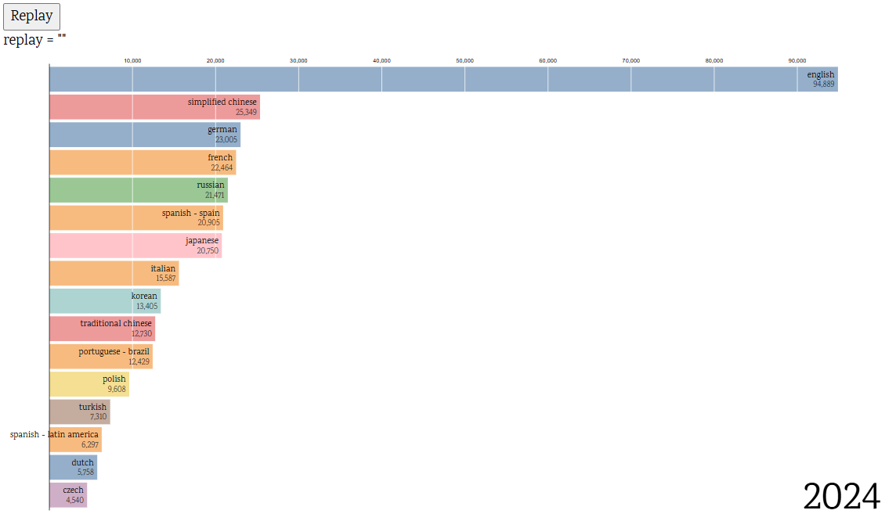

# Descripción del proyecto

En la actualidad existen múltiples iniciativas de datos abiertos y plataformas que facilitan el uso de datos públicos por parte de los profesionales y ciudadanos en general, con el objetivo de enriquecer las noticias y contrastar las cifras ofrecidas por las diversas fuentes. epData es una de dichas plataformas: https://www.epdata.es/

epData es la plataforma de datos creada por Europa Press y cuenta con financiación de la Digital News Initiative de Google. En epData podrás encontrar gráficos y datos sobre una gran cantidad de variables sociodemográficas.

En esta actividad tenéis que crear una visualización interactiva en D3.js que permita analizar tendencias presentes en cualquiera de los ámbitos recogidos en epData: población, deuda pública, empleo, crimen, vivienda, pensiones, estimación de voto, accidentes de tráfico, etc…

También podéis escoger cualquier otra fuente de datos local de vuestra ciudad o país.

En la visualización podrán existir una o más gráficas y se incorporarán todos aquellos elementos (leyendas, tooltips, animaciones, escalas de tamaños, colores, gestión de eventos…) que contribuyan a un mejor entendimiento de las variables seleccionadas.

# Entrega de la actividad

1. Tienes que entregar el documento Word o PDF con la actividad explicada, el código completo documentado y las gráficas insertadas. 
2. También es obligatorio entregar todos los ficheros que necesarios para generar la visualización:
   - Fichero HTML
   - Fichero Javascript
   - Dataset 

# Valoración de la actividad

La nota dependerá de la documentación del código, la calidad de las gráficas desarrolladas, la sencillez en su análisis e interpretación y el grado de interacción existente entre las diferentes gráficas o elementos incluidos en la visualización.

También se valorará el grado de originalidad y la modificación/ampliación del código que realice el equipo respecto a los ejercicios realizados en las sesiones presenciales.
## Consejos
- No os cerréis al primer caso que elijáis y si queréis cambiar porque habéis visto que vuestra primera elección no os gusta, cambiad.
- Ved TODAS las variables del dataset y entender qué significan, cuáles pueden ser útiles para vuestro caso y cuáles no.
- Pensad en las preguntas de negocio a las que queréis dar una respuesta con vuestras visualizaciones.

# Tabla de Tareas
| Encargado | Tarea                               |
|-----------|-------------------------------------|
| Andoni    | Zoomable sunburst                   |
| Andoni    | Barchart Race                       |
| Andoni    | Treemap                             |
| Jesús     | Chord diagram                       |
| Jesús     | Piechart                            |
| Alex      | Wordcloud                           |
| Alex      | Preparar documento PDF con gráficas |
| Todos     | Juntarlo HTML                       |

# Figuras
## Pie chart

Este gráfico permite las categorías más comunes de los juegos y la cantidad de jugadores que tienen. En este caso se han elegido las 15 categorías más comunes.

Conclusiones: La categoría más común es la de "Indie" formando alrededor del 12% de los datos. Además si tomamos las 5 categorías más comunes ya vemos que forman más del 50% de las 15 categorías más comunes de Steam.

## Chord diagram

Este gráfico visualiza los 5 géneros más comunes y traza relaciones entre ellos para entender la coincidencia de estos géneros en los distintos juegos. Dicho de otra manera describe las veces en las que los géneros aparecen a la vez.

Conclusiones: Los géneros están altamente interconectados. Las probabilidades de que los géneros coincidan son casi equiprobables rondando entre el 0.6% y el 0.8% de las veces. Esto destaca que los géneros más comunes suele siempre ir de la mano. Esto podría llevar a pensar que es así para todos los casos. Sin embargo, existen más de 200 categorías de juegos y muchas no tienen esta cantidad de interconexión. Este gráfico, idealmente, podría ser filtrado de forma dinámica para elegir distintas categorías y poder comparar las interconexiones entre géneros de distintas categorías. Esto podría llevar a la conclusión de que los géneros más comunes son los que más se interconectan entre sí y que los menos comunes no tienen esta interconexión.

## Sunburst

Este gráfico permite ver la proporción de jugadores por desarrolladora y juego, pero no permite ver la proporción de jugadores por desarrolladora y el número de juegos que tiene cada desarrolladora.

Conclusiones: 4 desarrolladoras hacen el 50% de las 20 desarrolladoras con más jugadores en sus juegos.
Valve es la principal, con más de un 25% de los jugadores. Es muy probable que esto se deba a que es la propietaria de la plataforma STEAM y pueda publicitar aquí sus juegos.

## Treemap

Este gráfico permite visualizar mejor la distribución de jugadores por desarrolladora y juego, ya que el gráfico de sunburst no permite ver la proporción de jugadores por desarrolladora y juego.

Conclusiones: CSGO contiene un porcentaje 12% de los jugadores de la plataforma. Otras desarrolladoras que contienen una gran porción de los jugadores están divididas en distintos juegos excepto PUBG, Terraria, Rust, Among Us y algunos otros juegos cuyas desarrolladoras no tienen más que un juego con grandes números de jugadores.

## Wordcloud

Este gráfico visualiza las palabras más comunes de las descripciones de un set de juegos seleccionado. Estos juegos son aquellos de las 10 publicadoras con más jugadores que se han analizado en el zoomable sunburst.

Conclusiones: Es muy común encontrarse números entre las palabras más comunes como one, two o first. Pero las palabras más comunes son game, new, world. Entre otros también se encuentran palabras como play, explore, strategy, experience o pc.

## Bar Chart Race

Este gráfico permite ver la evolución de los idiomas más comunes en Steam a lo largo del tiempo. En este caso se mostrarán a cada año los 16 idiomas más comunes y se ha hecho un gráfico de evolución de estos idiomas desde 1997 hasta 2025.

Conclusiones: Vemos un comienzo lento de aparición de juegos e idiomas en la plataforma de Steam que al ser una empresa estadounidense y contener videojuegos es normal que los idiomas más comunes de plataforma fuese desde el principio el inglés. Sin embargo, es interesante ver cómo los idiomas asiáticos como el chino apareció prácticamente de la nada en 2020 para colocarse en la segunda posición superando al alemán y al resto de lenguas romances. En 2015 el alemán y el francés se colocan en la tercera y cuarta posición respectivamente, seguidos del ruso, el español localizado en España y el japonés. En 2020 el español se coloca en la tercera posición superando al alemán y al francés. En 2025 el español se coloca en la segunda posición superando al alemán y al francés. También paso similar con el ruso que se encontraba más abajo desde el principio. La aparición constante de las lenguas romances son menos descriptivas de la tendencia pero de este gráfico se puede observar que la mayor cantidad de los esfuerzos de traducción se quedan en el inglés, lenguas romances y recientemente ha irrumpido el gigante asiático en el desarrollo o traducción de videojuegos. 